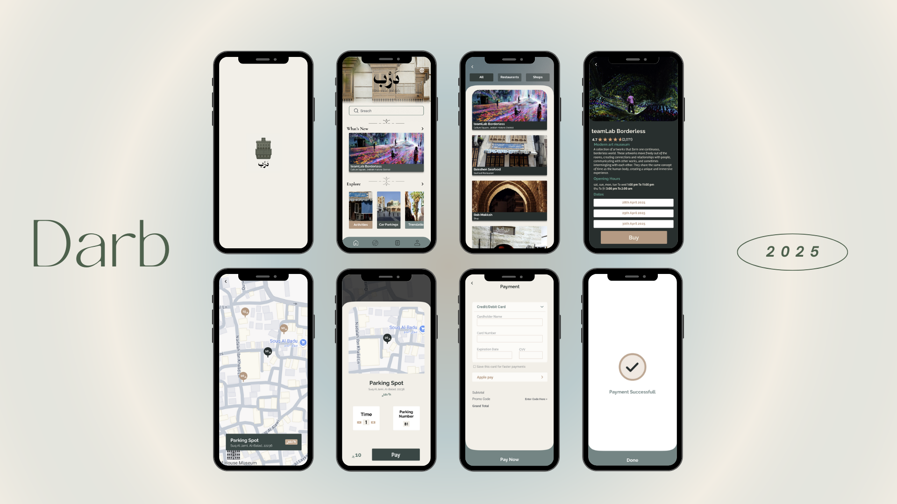

# 🧭 Darb – Historic Jeddah Tourist Guide App (Prototype)

**Darb** is a mobile UI/UX prototype created for the **Human-Computer Interaction (HCI)** course.  
It was designed to enhance the tourist experience in **Historic Jeddah (Al-Balad)** by providing essential information, interactive navigation, and convenient services through a user-centered mobile interface.

---

## 📱 App Overview

The app allows users to:
- Browse popular destinations and historical landmarks
- View detailed descriptions, photos, and ticket booking options
- Find parking spots with real-time availability
- Navigate using an interactive map
- Make secure in-app payments

---

## 🎯 Academic Context

This prototype was developed as part of a university course project in **Human-Computer Interaction**.  
It applies key HCI principles such as:
- User-centered design
- Clear navigation flow
- Accessibility and simplicity
- Consistent UI and visual hierarchy

---

## 🔗 Figma Link

👉 [View the Darb prototype in Figma](https://www.figma.com/design/RhNLiDniTUDymlo4KRJrg0/Darb-final?node-id=0-1&t=w14mlOtAng6wLnh5-1)

---

